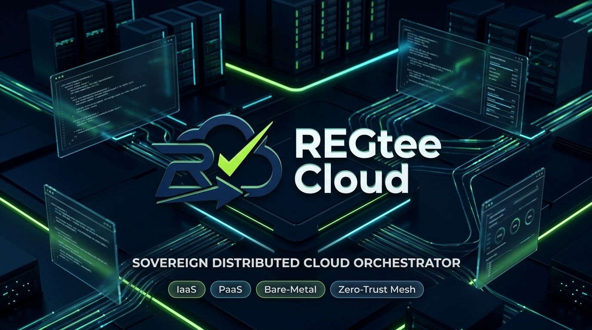

<div align="center">



<br/><br/>

# ⚡ REGtee Cloud

### Sovereign Distributed Cloud Orchestrator (PaaS / IaaS / VPS)
**An Enterprise-Grade, Self-Healing Bare-Metal Cloud Platform Engineered in Go & Astro**

<br/>

[](https://golang.org)
[](https://astro.build)
[](https://react.dev)
[](https://bun.sh)
[](https://rabbitmq.com)
[](https://proxmox.com)
[](https://wireguard.com)
[](https://dagger.io)
[](https://postgresql.org)
[](architecture/01-SYSTEM-OVERVIEW.md)
[](architecture/04-DATA-SOVEREIGNTY-UUPDP.md)
[](LICENSE)

<br/>

**Performa Tanpa Kompromi, Jaringan Aman Berdaulat.**  
*Transforming regional bare-metal hardware into an automated, self-healing sovereign cloud platform.*  
*Bypassing ISP Carrier-Grade NAT (CGNAT) via WireGuard Mesh with Zero In-Place Target Node Compiling.*

<br/>

[🏛️ Architecture](#-system-architecture-overview) •
[⚡ 3-in-1 Cloud Engine](#-the-3-in-1-cloud-engine) •
[🎯 Key Innovations](#-key-engineering-innovations) •
[📊 Comparison Matrix](#-why-regtee-cloud-the-comparison) •
[📚 Documentation Hub](#-portfolio-documentation-hub) •
[📦 Microservices Topology](#-isolated-microservices-topology) •
[🧪 Testing Pyramid](#-three-tier-testing-pyramid)

</div>

---

## 🧭 Executive Overview

**REGtee Cloud** is an enterprise-grade distributed cloud orchestrator engineered to transform independent on-premise bare-metal servers into a fully automated, sovereign PaaS/IaaS cloud environment. Built as a high-performance **Go 1.25+ microservices monorepo** and modern **Astro v5 + React 19 Islands** frontend, it solves two of the most critical structural bottlenecks in emerging cloud markets:

1. **Bypassing ISP Carrier-Grade NAT (CGNAT)** without purchasing expensive public IPv4 leases or port-forwarding hardware.
2. **Guaranteeing 100% Data Sovereignty** under personal data protection statutory mandates (**UU No. 27 Tahun 2022 / UU PDP**), ensuring zero tenant data ever leaves the sovereign physical perimeter.

> [!TIP]
> **Production Verification**: All architectural blueprints, message routing flows, and hypervisor drivers in this showcase have been tested and verified against physical Proxmox VE hypervisors, real Docker Dagger v0.18.9 daemons, live WireGuard mesh tunnels, and active TCP SSH Bastions.

---

## 🏛️ System Architecture Overview

REGtee Cloud establishes a clean separation of concerns between public edge traffic termination and localized bare-metal execution:

```text
                                  PUBLIC INTERNET
                                         │
                 ┌───────────────────────┴───────────────────────┐
                 │                                               │
         [HTTPS / Ingress]                               [SSH / Bastion]
                 │                                               │
                 ▼                                               ▼
   ┌───────────────────────────┐                   ┌───────────────────────────┐
   │       Caddy Ingress       │                   │    SSH Gateway Bastion    │
   │  Dynamic TLS Reverse Proxy│                   │ Native TCP SSH (Port 2222)│
   └─────────────┬─────────────┘                   └─────────────┬─────────────┘
                 │                                               │
                 │             PUBLIC EDGE GATEWAY TIER          │
                 │          (Tier-4 Datacenter Edge Relay)       │
                 └───────────────────────┬───────────────────────┘
                                         │
                    ┌────────────────────┴────────────────────┐
                    │  Headscale Control Plane (Mesh Coord)   │
                    └────────────────────┬────────────────────┘
                                         │
         ======================= WIREGUARD MESH OVERLAY =======================
                                (100.64.0.0/10 CGNAT Safe)
                                         │
                 ┌───────────────────────┴───────────────────────┐
                 │                                               │
                 ▼                                               ▼
   ┌───────────────────────────┐                   ┌───────────────────────────┐
   │       Core REST API       │◄─────────────────►│    RabbitMQ AMQP Broker   │
   │   Control Plane Engine    │                   │   Topic Exchanges & DLQ   │
   └─────────────┬─────────────┘                   └─────────────┬─────────────┘
                 │                                               │
                 ├───────────────────────────────┬───────────────┴─────────────┐
                 ▼                               ▼                             ▼
   ┌───────────────────────────┐   ┌───────────────────────────┐ ┌───────────────────────────┐
   │     Instance Planter      │   │        App Builder        │ │    Saga Orchestrator      │
   │  Proxmox LXC/VM Provision │   │  Dagger SDK + Nixpacks    │ │ Distributed Transactions  │
   └─────────────┬─────────────┘   └─────────────┬─────────────┘ └───────────────────────────┘
                 │                               │
                 ▼                               ▼
   ┌───────────────────────────┐   ┌───────────────────────────┐
   │  Proxmox VE Hypervisors   │   │  Private Docker Registry  │
   │   Bare-Metal Virtual Encl │   │  Local Container Storage  │
   └───────────────────────────┘   └───────────────────────────┘
               REGIONAL SOVEREIGN ON-PREMISE COMPUTE CLUSTER
```

---

## ⚡ The 3-in-1 Cloud Engine

REGtee integrates three essential cloud service tiers into a unified, single-pane-of-glass dashboard:

| Cloud Model | Capabilities & Virtualization | Technology Stack |
|:---|:---|:---|
| **IaaS (Bare-Metal VPS)** | Automated provisioning of lightweight Linux Containers (LXC) and full hardware-virtualized Virtual Machines (KVM) with declarative Terraform state tracking. | Proxmox VE 8/9, OpenTofu, ZFS Enterprise Pools |
| **PaaS (Git-to-Deploy)** | Continuous deployment directly from GitHub/GitLab commits. Zero in-place compilation on target nodes with automated Let's Encrypt SSL and zero-downtime rolling deploys. | Nixpacks, Dagger SDK v0.18.9, Private OCI Registry |
| **SaaS (1-Click Marketplace)**| Instant launch of production-ready, pre-configured application stacks (PostgreSQL 16, MySQL, Redis/Valkey, WordPress, Metabase) with automated backup hooks. | Pre-compiled OCI images, Caddy Dynamic Ingress |

---

## 🎯 Key Engineering Innovations

### 1. 🛡️ Inbound CGNAT Bypass via WireGuard Mesh Overlay
* **The Problem**: Regional fiber broadband lines sit behind Carrier-Grade NAT (`100.64.0.0/10`), blocking all inbound traffic (ports 80, 443, 22) and rendering self-hosting impossible without expensive static IP subnets.
* **The Solution**: An encrypted point-to-point **Tailscale WireGuard Mesh** coordinated by an open-source **Headscale Control Plane** hosted on an edge gateway. Nodes establish direct UDP peer-to-peer tunnels via STUN/NAT hole-punching, falling back to encrypted DERP relays with sub-35ms latency.
* 📖 *Deep Dive*: [**CGNAT Bypass via Tailscale & Headscale WireGuard Mesh**](architecture/02-CGNAT-WIREGUARD-MESH.md)

### 2. ⚡ Zero In-Place Target Node Compiling (Runtime Purity Enclaves)
* **The Anti-Pattern**: Traditional self-hosted PaaS tools (CapRover, Dokku) run `npm install` and `next build` inside the tenant's container, causing catastrophic Linux Out-Of-Memory (OOM) kills and bloating disk images.
* **The Solution**: Target containers remain **pristine runtime enclaves (<30MB RAM overhead)**. All source compilation executes on a dedicated Pontianak Build Grid orchestrated by the **Dagger SDK (v0.18.9)**. Pre-built OCI images are pushed to a private cluster registry, enabling **instant rollbacks under 2 seconds**.
* 📖 *Deep Dive*: [**PaaS Build Grid with Dagger SDK & Nixpacks**](features/02-PAAS-DAGGER-NIXPACKS-GRID.md)

### 3. 💻 Dual-Mode Secure Remote Access
* **Vector A (Native TCP Bastion `:2222`)**: Authenticates developers via registered Ed25519 public SSH keys and transparently dials target containers across the private WireGuard mesh (`ssh -p 2222 {vmid}_{user}@bastion.example.com`).
* **Vector B (In-Browser Web Terminal `:8022`)**: Interactive Xterm.js terminal over secure WebSockets (WSS), authenticated via atomic 60-second One-Time Keys (OTK) with dynamic terminal window resizing (`pty.WindowSize`).
* 📖 *Deep Dive*: [**Dual-Mode Remote Access: TCP Bastion & Web Terminal**](features/03-DUAL-MODE-SSH-TERMINAL.md)

### 4. 🔄 Event-Driven Saga Orchestration with AMQP 0-9-1
* Heavy hypervisor and container build operations are fully decoupled from the Core REST API via **RabbitMQ Topic Exchanges**.
* A dedicated **Saga Orchestrator** manages multi-service workflows and executes automated **compensating rollback transactions** if any intermediate provisioning step fails.
* Dedicated Dead-Letter Exchanges (`*.dlx`) ensure zero lost messages and prevent queue head-of-line blocking.
* 📖 *Deep Dive*: [**Event-Driven Microservices & Saga Orchestration**](architecture/03-EVENT-DRIVEN-AMQP.md)

### 5. 🌐 Dynamic Zero-Downtime Edge Ingress (Caddy Admin API)
* Eliminates the traditional `nginx -s reload` anti-pattern that drops active WebSocket pipes and TCP connections.
* The `ingress-controller` microservice pushes dynamic JSON routing rules into Caddy's in-memory Admin API (`localhost:2019`) over AMQP events, issuing automatic Let's Encrypt TLS certificates in real time.
* 📖 *Deep Dive*: [**Dynamic Ingress: Automated Reverse Proxy & SSL**](features/04-DYNAMIC-CADDY-INGRESS.md)

### 6. 🏛️ Strict 4-Layer Clean Architecture in Go
* Inward-pointing dependency rule across all 7 Go microservices:  
  `Domain Entities (Layer 1)` ➔ `Use Cases & Ports (Layer 2)` ➔ `Interface Adapters (Layer 3)` ➔ `Frameworks & Drivers (Layer 4)`.
* Zero cross-service package imports; services interact exclusively through strongly typed contracts.
* 📖 *Deep Dive*: [**Clean Architecture and Zero Coupling in Go Monorepos**](case-studies/CASE-STUDY-02-CLEAN-ARCHITECTURE-MONOREPO.md)

---

## 📊 Why REGtee Cloud? The Comparison

| Feature / Architecture | Hyperscaler Cloud (AWS / GCP) | Traditional Self-Hosted (CapRover / Dokku) | REGtee Cloud (Sovereign Orchestrator) |
|:---|:---:|:---:|:---:|
| **Operating Cost (OpEx)** | 🔴 High ($$$) + Egress Tax | 🟡 Moderate (Requires VPS) | 🟢 **Minimal (80%+ Savings on Bare-Metal)** |
| **Data Sovereignty (UU PDP)** | 🔴 Vulnerable to Foreign Cloud Acts | 🟡 Dependent on hosting VPS | 🟢 **100% Local Sovereign Data Residency** |
| **Inbound CGNAT Bypass** | ⚪ N/A (Public Cloud IPs) | 🔴 Fails on CGNAT (Needs Static IP) | 🟢 **Native WireGuard Mesh Overlay** |
| **Node Build Isolation** | 🟢 Cloud CI/CD Services | 🔴 Compiles in-place (High OOM risk) | 🟢 **Dedicated Ephemeral Dagger Build Grid** |
| **Deployment Footprint** | 🔴 Heavy Agent Overhead | 🟡 Medium Docker overhead | 🟢 **Ultra-Lightweight (<30MB RAM LXC Enclave)** |
| **Atomic Rollback Speed** | 🟡 1–5 minutes | 🔴 Slow (Re-pull or rebuild) | 🟢 **Instant (<2 seconds OCI Tag Switch)** |
| **Remote Access Modes** | 🟡 SSH Key / Bastion only | 🔴 Manual SSH / Open router ports | 🟢 **Dual-Mode (TCP :2222 Bastion + WSS Terminal)** |
| **Reverse Proxy Reloads** | 🟢 Managed ALB / Ingress | 🔴 Process reload (Drops WebSockets) | 🟢 **Dynamic In-Memory Caddy API (0 Drops)** |

---

## 📚 Portfolio Documentation Hub

Explore the full collection of technical architecture documents, API contracts, and engineering case studies:

<details open>
<summary><b>🏛️ System Architecture Blueprints</b></summary>
<br/>

- [**01. System Architecture & Monorepo Topology**](architecture/01-SYSTEM-OVERVIEW.md)  
  *Detailed breakdown of the 7 microservices, Go workspace monorepo structure, and clean architecture enforcement.*
- [**02. CGNAT Bypass via Tailscale & Headscale WireGuard Mesh**](architecture/02-CGNAT-WIREGUARD-MESH.md)  
  *In-depth look at encrypted overlay networking, NAT hole-punching, DERP relays, and dual-region routing.*
- [**03. Event-Driven Microservices with RabbitMQ & Saga Orchestration**](architecture/03-EVENT-DRIVEN-AMQP.md)  
  *Message bus topology, topic routing schemas, dead-letter recovery, and distributed saga state machines.*
- [**04. 100% Data Sovereignty & UU PDP Compliance Blueprint**](architecture/04-DATA-SOVEREIGNTY-UUPDP.md)  
  *Ensuring zero client data leaves the local jurisdiction while providing modern cloud-native developer ergonomics.*

</details>

<details open>
<summary><b>⚡ Core Feature Engineering Deep Dives</b></summary>
<br/>

- [**01. IaaS: Bare-Metal Virtualization via Proxmox VE & Terraform IaC**](features/01-IAAS-PROXMOX-ORCHESTRATION.md)  
  *Automated provisioning of lightweight Linux Containers (LXC) and full KVM virtual machines with OpenTofu/Terraform state tracking.*
- [**02. PaaS: Ephemeral Build Grid with Dagger SDK & Nixpacks**](features/02-PAAS-DAGGER-NIXPACKS-GRID.md)  
  *Containerized CI/CD build engine, zero-config language detection, vulnerability scanning with Trivy, and instant rollbacks.*
- [**03. Dual-Mode Remote Access: TCP Bastion & In-Browser WebSocket Terminal**](features/03-DUAL-MODE-SSH-TERMINAL.md)  
  *Native SSH multiplexer and Xterm.js WebSocket PTY gateway with single-use cryptographic tokens.*
- [**04. Dynamic Ingress: Automated Reverse Proxy & SSL via Caddy**](features/04-DYNAMIC-CADDY-INGRESS.md)  
  *Event-driven reverse proxy routing over AMQP, zero reload downtime, and automated Let's Encrypt TLS issuance.*

</details>

<details open>
<summary><b>📜 System Contracts & Protocols</b></summary>
<br/>

- [**REST API Specifications & Architecture**](contracts/API-SPECIFICATIONS.md)  
  *REST API design standards, OpenAPI/Swagger contracts, authentication flow, and error taxonomy.*
- [**AMQP 0-9-1 Messaging Protocols & Schemas**](contracts/AMQP-MESSAGING-SPEC.md)  
  *Complete exchange, routing key, and JSON payload contracts across microservices.*

</details>

<details open>
<summary><b>📊 Real-World Engineering Case Studies</b></summary>
<br/>

- [**Case Study 1: 80% Infrastructure Cost Reduction for Regional Software Agencies**](case-studies/CASE-STUDY-01-COST-OPTIMIZATION.md)  
  *Economic and architectural comparison between foreign hyperscalers (AWS/GCP) and REGtee bare-metal clusters.*
- [**Case Study 2: Enforcing Clean Architecture and Zero Coupling in Go Monorepos**](case-studies/CASE-STUDY-02-CLEAN-ARCHITECTURE-MONOREPO.md)  
  *Techniques, linter enforcement, and patterns used to maintain strict domain purity across 7 Go microservices.*

</details>

---

## 📦 Isolated Microservices Topology

The backend is organized into 7 decoupled microservices using **Go Workspaces (`go.work`)**:

```text
services/
├── core-api/            # Control Plane REST API (Gin, PostgreSQL 16, JWT, RBAC)
├── instance-planter/    # Hypervisor Worker (Proxmox VE API, OpenTofu, LXC/KVM)
├── app-builder/         # PaaS Build Grid (Dagger SDK v0.18.9, Nixpacks, Trivy)
├── ssh-gateway/         # Dual Bastion (TCP SSH :2222, WebSocket Terminal :8022)
├── ingress-controller/  # Dynamic Edge Reverse Proxy (Caddy Admin API via AMQP)
├── network-controller/  # WireGuard Mesh Manager (Headscale REST API & ACLs)
└── orchestrator/        # Distributed Saga Coordinator (Compensating Transactions)
```

### Clean Architecture Code Standard (Sample Port Interface)

```go
// Package usecase declares abstract ports (Dependency Inversion Principle)
package usecase

import (
    "context"
    "regtee/instance-planter/internal/domain"
)

type HypervisorPort interface {
    CreateContainer(ctx context.Context, req domain.CreateInstanceRequest) (*domain.InstanceResult, error)
    DestroyContainer(ctx context.Context, vmid int) error
    GetTelemetry(ctx context.Context, vmid int) (*domain.TelemetryMetrics, error)
}
```

---

## 🧪 Three-Tier Testing Pyramid

Every architectural subsystem is validated through a rigorous three-tier testing pyramid:

```text
                       THE THREE-TIER TEST PYRAMID
                     ┌─────────────────────────────┐
                     │   Tier 3: Physical Live     │  Real Proxmox hypervisors,
                     │   Hypervisor Tests          │  live WireGuard mesh nodes,
                     │  (tests/actual/*_test.go)   │  actual TCP Bastion :2222
                     ├─────────────────────────────┤
                     │   Tier 2: In-Memory Work-   │  Simulated multi-service
                     │   flow Integration Tests    │  Saga workflows, AMQP bus,
                     │   (tests/e2e/*_test.go)     │  database state transitions
                     ├─────────────────────────────┤
                     │   Tier 1: Unit Tests        │  Pure domain validation,
                     │   (internal/usecase/*)      │  interactors with DIP mocks,
                     │                             │  zero external dependencies
                     └─────────────────────────────┘
```

---

## 🛡️ Data Sovereignty & UU PDP Statutory Compliance

REGtee Cloud strictly adheres to the provisions of the Republic of Indonesia's **Undang-Undang Nomor 27 Tahun 2022 tentang Pelindungan Data Pribadi (UU PDP)**:

* **Strict Local NVMe Residency**: All tenant databases, uploaded assets, and container filesystems reside exclusively on physical NVMe storage pools inside the regional on-premise datacenter.
* **Stateless Edge Perimeter**: The edge gateway functions exclusively as an ephemeral reverse proxy. Zero tenant payloads are cached or written to disk outside the sovereign boundary.
* **Immunity to Foreign Extraterritorial Acts**: Because all tenant data resides within Indonesian sovereign hardware, data is fully insulated from foreign extraterritorial discovery warrants (such as the US CLOUD Act).

---

## 🔒 Confidentiality & Sanitization Notice

All documentation, architectural diagrams, and schema specifications within this public showcase repository have been sanitized for public presentation:
* **Network IP Addressing**: Strictly uses **RFC 5737** (`198.51.100.0/24`) and **RFC 6598** (`100.64.0.0/10`) documentation blocks.
* **Domain Names**: Uses **RFC 2606** reserved example domains (`*.example.com`).
* **Cryptographic Keys**: Public keys, tokens, and credentials shown are synthetic architectural mockups.
* **Physical Nodes**: Physical node names and container hostnames are abstracted into architectural roles (`cluster-node-01`, `demo-app-container`).

---

## 📄 License & Attribution

This architectural showcase is distributed under the **Apache License 2.0**. See the [LICENSE](LICENSE) file for complete terms.

<div align="center">

**Built with pride by the Sovereign Cloud Platform Engineering Team**  
*Powering the future of independent, sovereign cloud infrastructure.*

⭐ **If you find this architectural blueprint insightful, please star the repository!** ⭐

</div>
