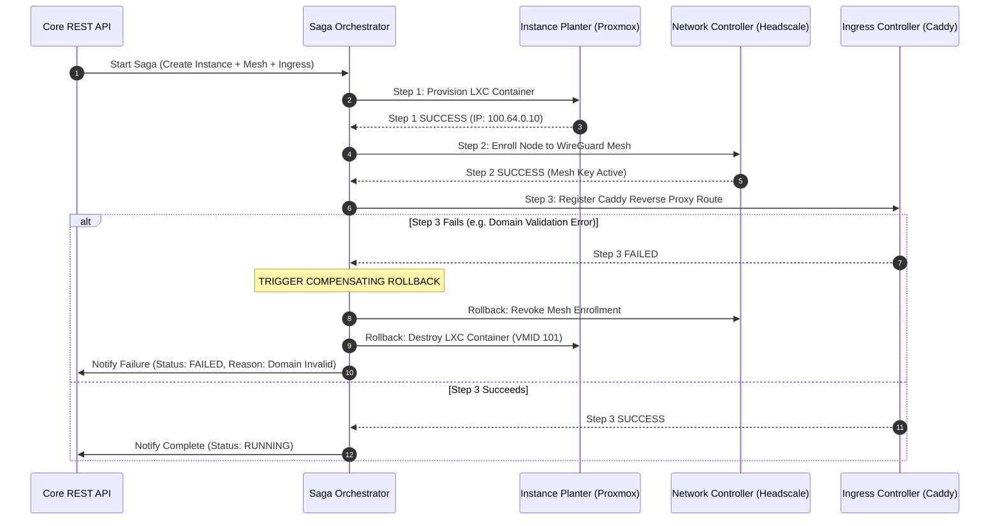

# Event-Driven Microservices with RabbitMQ & Saga Orchestration

> **Document Version**: 1.0  
> **Classification**: Public Engineering Showcase  
> **Topic**: Asynchronous Messaging, AMQP 0-9-1, Saga Pattern, Distributed Fault Tolerance

---

## 1. Architectural Philosophy: Decoupled & Non-Blocking

In a distributed cloud orchestrator, provisioning hypervisor resources (LXC containers, KVM VMs) and running containerized build grids (Nixpacks/Dagger) are heavy, long-running I/O operations (taking between 5 to 90 seconds). 

To ensure the **Core REST API maintains sub-50ms P99 response times** and never blocks client HTTP connections, REGtee Cloud implements an **Asynchronous Event-Driven Architecture** powered by **RabbitMQ 3.13 (AMQP 0-9-1)**.

```
  [Client Browser]
         │  POST /api/v1/instances (JSON)
         ▼
 ┌────────────────┐
 │    Core API    │ ─── 1. Inserts 'PENDING' DB Record
 └───────┬────────┘ ─── 2. Publishes AMQP Event (`instance.provision`)
         │          ─── 3. Responds instantly with HTTP 202 Accepted {id: "inst-123"}
         │
         ▼
 ┌─────────────────────────────────────────────────────────────────┐
 │                  RabbitMQ Topic Exchange                        │
 │               (regtee.events / amq.topic)                       │
 └───────┬─────────────────────────┬───────────────────────┬───────┘
         │ routing_key:            │ routing_key:          │ routing_key:
         │ "instance.provision"    │ "ingress.sync"        │ "network.enroll"
         ▼                         ▼                       ▼
 ┌────────────────┐       ┌────────────────┐      ┌────────────────┐
 │Instance Planter│       │Ingress Cntlr   │      │Network Cntlr   │
 │(Worker Proxmox)│       │(Caddy API Sync)│      │(Headscale Mesh)│
 └────────────────┘       └────────────────┘      └────────────────┘
```

---

## 2. Topic Exchange Topology & Routing Keys

REGtee utilizes standard AMQP 0-9-1 Topic Exchanges to route messages based on dot-delimited routing patterns (`domain.action`):

```
Exchange: `regtee.direct` (or `amq.topic`)
  ├── Binding: `instance.#`       ──► Queue: `instance-planter.queue`
  ├── Binding: `build.#`          ──► Queue: `app-builder.queue`
  ├── Binding: `ingress.#`        ──► Queue: `ingress-controller.queue`
  ├── Binding: `network.#`        ──► Queue: `network-controller.queue`
  └── Binding: `orchestrator.#`   ──► Queue: `saga-orchestrator.queue`
```

### Standardized Event Payload Schema

All event payloads share a unified JSON contract containing tracing metadata, tenant boundaries, and task parameters:

```json
{
  "event_id": "evt_01J7KXYZ89ABCDEF01234567",
  "correlation_id": "corr_9a8b7c6d-5e4f-3a2b-1c0d",
  "event_type": "instance.provision.requested",
  "timestamp": "2026-09-10T21:00:00Z",
  "workspace_id": "ws_alpha_corp_01",
  "user_id": "usr_99887766",
  "payload": {
    "instance_id": "inst_deb12_web01",
    "vmid": 101,
    "node": "cluster-node-01",
    "template": "debian-12-standard",
    "cores": 2,
    "memory_mb": 1024,
    "disk_gb": 10,
    "authorized_keys": [
      "ssh-ed25519 AAAAC3NzaC1lZDI1NTE5AAAAIExamplePublicKeyUser"
    ]
  }
}
```

---

## 3. Distributed Saga Orchestration & Rollbacks

Provisioning an application or cloud instance is a multi-step distributed transaction that crosses several microservices. REGtee Cloud utilizes a **Dedicated Saga Orchestrator** to coordinate state and execute **compensating transactions** if any intermediate step fails:



---

## 4. Resilience: Dead-Letter Exchanges (DLX) & Idempotency

### Dead-Letter Recovery Flow:
1. When a worker encounters a transient network failure (e.g. hypervisor busy), the message is rejected with `Nack(requeue=false)`.
2. RabbitMQ automatically forwards the rejected message to the service's designated Dead-Letter Exchange:  
   `instance-planter.dlx` ──► `instance-planter.dlq`.
3. A recovery daemon with exponential backoff inspects the DLQ, logs the error with full stack traces, and re-publishes to the main queue up to 3 retries before alerting operators via webhook.

### Strict Consumer Idempotency:
Every consumer enforces idempotency using Valkey/Redis atomic locks:
```go
// Atomic execution guard using correlation ID
lockKey := fmt.Sprintf("lock:event:%s", event.EventID)
acquired, err := valkeyClient.SetNX(ctx, lockKey, "processing", 10*time.Minute).Result()
if !acquired || err != nil {
    logger.Warn("Duplicate event detected, discarding", "event_id", event.EventID)
    return amqpDelivery.Ack(false)
}
```
This guarantees that network re-deliveries or broker failovers never produce duplicate hypervisor containers or corrupted billing events.
