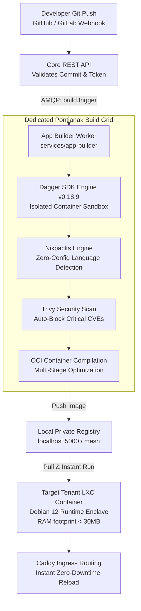

# PaaS: Ephemeral Build Grid with Dagger SDK & Nixpacks

> **Document Version**: 1.0  
> **Classification**: Public Engineering Showcase  
> **Service**: `services/app-builder`  
> **Topic**: Platform-as-a-Service, Git-to-Deploy, Dagger SDK, Nixpacks, Pure Runtime Enclaves

---

## 1. The Anti-Pattern: In-Place Compilation on Target Nodes

Traditional self-hosted control panels (like CapRover or Dokku) frequently build applications directly inside the tenant's production server or container. In constrained edge or regional environments, this causes catastrophic failure modes:

```
  THE IN-PLACE COMPILATION ANTI-PATTERN:
  ┌─────────────────────────────────────────────────────────────┐
  │ Tenant Production LXC Container (Allocated: 512MB RAM)      │
  │                                                             │
  │  1. `git clone` pulls source code + secrets to prod disk    │
  │  2. `npm install` consumes 400MB RAM                        │
  │  3. `next build` / `go build` spikes to 900MB RAM           │
  │                                                             │
  │  💥 LINUX OOM-KILLER TERMINATES DATABASE & PRODUCTION APP!  │
  │  Leftover build tools (GCC, Node, npm cache) bloat disk.    │
  └─────────────────────────────────────────────────────────────┘
```

---

## 2. The REGtee Way: The Ephemeral Build Grid Architecture

REGtee Cloud enforces **Zero In-Place Compilation on Target Nodes (Runtime Purity Mandate)**. Tenant nodes remain pristine, minimal runtime enclaves (<30MB RAM footprint). All compilation occurs on dedicated, high-spec worker nodes running the **Dagger SDK Engine**:



---

## 3. The 4-Stage CI/CD Pipeline

The `app-builder` service executes builds inside ephemeral Dagger pipelines with zero host pollution:

### Stage 1: Zero-Config Language Detection (Nixpacks)
Nixpacks inspects the tenant repository to automatically detect runtime requirements, package managers, and startup scripts:
- **Node.js**: Detects `package.json`, picks optimal runtime (Bun, Node 20, or pnpm), prepares minimal runtime layers.
- **Go**: Detects `go.mod`, compiles pure static binary with `CGO_ENABLED=0`.
- **Python / Rust / PHP / Java**: Injects exact compiler toolchains without manual Dockerfiles.

### Stage 2: DevSecOps Vulnerability Scan (Trivy Engine)
Before any image is deployed, Trivy performs a static vulnerability scan against operating system packages and application dependencies:
```go
// Trivy Vulnerability Guard
if report.CriticalCVECount > 0 && !deploymentConfig.AllowCriticalCVE {
    logger.Error("Deployment blocked by security policy", 
        "critical_cves", report.CriticalCVECount,
        "first_cve", report.Vulnerabilities[0].VulnerabilityID,
    )
    return ErrSecurityScanFailed
}
```

### Stage 3: Private Local Registry Distribution
Compiled container images are tagged with atomic commit hashes and pushed over the private WireGuard mesh to the cluster's internal registry:
```bash
localhost:5000/workspaces/{workspace_id}/{app_name}:{git_commit_sha}
```
Images never traverse the public internet, conserving bandwidth and eliminating exposure to public registries.

### Stage 4: Zero-Downtime Deployment & Instant Rollback
The target LXC container pulls the compiled OCI image using a lightweight container manager (Docker / Podman) and starts the container. Because every release is an immutable tagged image, **instant rollbacks take under 2 seconds**:
```bash
# Atomic Rollback: Simply re-point container to previous image tag
podman run -d --name app-v1 --restart=always -p 8080:8080 localhost:5000/ws1/myapp:sha_prev
```
