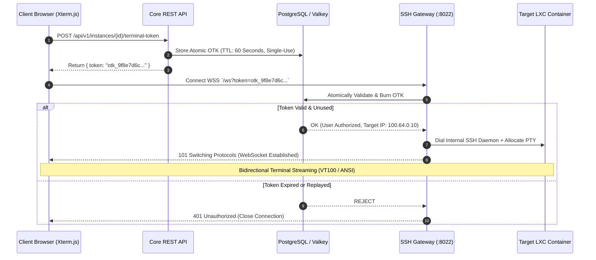

# Dual-Mode Remote Access: TCP Bastion & In-Browser WebSocket Terminal

> **Document Version**: 1.0  
> **Classification**: Public Engineering Showcase  
> **Service**: `services/ssh-gateway`  
> **Topic**: Secure Remote Management, Bastion Proxy, WebSocket PTY, One-Time Keys (OTK)

---

## 1. The Challenge: Secure Access Across CGNAT

Managing isolated virtual containers located on remote bare-metal hypervisors behind CGNAT typically requires either:
1. Opening direct SSH ports on physical routers (impossible with CGNAT), or
2. Installing complex, proprietary VPN software on every developer's workstation.

REGtee Cloud eliminates these requirements by introducing a **Dual-Mode Secure Remote Access Gateway** implemented in pure Go:

```
                                  DEVELOPER ACCESS VECTORS
 ┌───────────────────────────────────────────────┐  ┌───────────────────────────────────────────┐
 │       Vector A: Native Terminal CLI           │  │      Vector B: Modern Web Dashboard       │
 │   (VS Code Remote, macOS/Linux Terminal)      │  │        (Any Modern Web Browser)           │
 │                                               │  │                                           │
 │   `ssh -p 2222 {vmid}_{user}@bastion.example.com`    │  │   Xterm.js Web Terminal Interface         │
 └───────────────────────┬───────────────────────┘  └─────────────────────┬─────────────────────┘
                         │                                                │
                         ▼                                                ▼
         ┌───────────────────────────────┐                ┌───────────────────────────────┐
         │ Native TCP Bastion Proxy      │                │ In-Browser WebSocket Gateway  │
         │ (Listen: :2222 TCP)           │                │ (Listen: :8022 WSS /ws)       │
         └───────────────┬───────────────┘                └───────────────┬───────────────┘
                         │                                                │
                         └───────────────────────┬────────────────────────┘
                                                 │
                                                 ▼
                                 ┌───────────────────────────────┐
                                 │      `ssh-gateway` Worker     │
                                 │   (Pure Go crypto/ssh & WSS)  │
                                 └───────────────┬───────────────┘
                                                 │
                                  Encrypted WireGuard Mesh Tunnel
                                                 │
                                                 ▼
                                 ┌───────────────────────────────┐
                                 │   Target Proxmox Container    │
                                 │   Debian 12 PTY (100.64.0.10) │
                                 └───────────────────────────────┘
```

---

## 2. Vector A: Native TCP SSH Bastion (`:2222`)

Developers who prefer standard command-line tools, scripts, or IDEs (like VS Code Remote SSH) connect directly to the Bastion port:

```bash
ssh -p 2222 {vmid}_{user}@bastion.example.com
```

### Connection Flow & Security:
1. **Public Key Verification**:
   The Bastion's `ssh.ServerConfig.PublicKeyCallback` intercepts the incoming connection, parses the username (`{vmid}_{user}`), and cryptographically validates the presented public key against the tenant's registered keys stored in the PostgreSQL database.
2. **Transparent Target Dialing**:
   Upon successful authentication, the Bastion queries the hypervisor registry for the container's WireGuard mesh IP (e.g. `100.64.0.10:22`) and dials the internal SSH daemon over the encrypted overlay.
3. **PTY & Bidirectional Channel Proxy**:
   The gateway requests a pseudo-terminal (PTY) on the remote container and bridges stdin/stdout/stderr channels concurrently, guaranteeing sub-millisecond keyboard response times without intermediate disk logging.

---

## 3. Vector B: In-Browser Web Terminal via WebSocket (`:8022`)

For quick operational tasks, debugging, or users without local SSH keys configured, REGtee provides an embedded browser terminal:



---

## 4. Resilience & Terminal Window Resizing

A common pitfall in web terminal implementations is text truncation when browser windows are resized. REGtee handles dynamic terminal geometry through structured JSON control frames:

```json
{
  "type": "resize",
  "cols": 120,
  "rows": 34
}
```

When received, the Go WebSocket handler translates the message into a kernel PTY window change signal (`pty.WindowSize`), immediately alerting the remote shell (`bash`/`zsh`) to adjust screen wrapping and cursor positioning.
